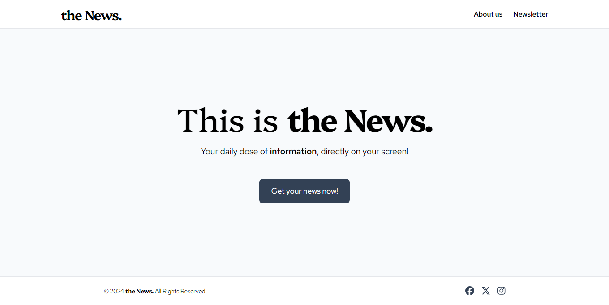

# the News. (Frontend assignment from Mognito)

This is the repository of the frontend assigment from Mognito. You can access its deployment by clicking on the link below:

https://main.d1nb3hcdj797q7.amplifyapp.com/

<br />

<div align="center">
  
</div>

## App requirements

#### 1. User can login to the app
- [x] Consider only email password login
- [x] User confirmation via OTP

#### 2. After login, the user can see a list of “News”
- [x] NEWS can have title
- [x] Tapping on any NEWS, users can see detailed screens where you will show a description
- [x] Users can press back to come to the NEWS page

## Installation

1. Clone the repository:

    ```bash
    git clone https://github.com/dalvancarvalho/mognito-frontend-assignment.git
    ```

2. Go to its folder:

   ```bash
   cd mognito-frontend-assignment
   ```

3. Install the project's dependencies:
   
   ```bash
   npm install
   ```

4. Initialize AWS Amplify environment (hit 'Enter' on subsequent prompts):
   
   ```bash
   amplify init
   ```
   
5. Run the development server:

   ```bash
   npm run dev
   ```

## Some considerations

#### About the app and assigment

- Since the application resembles a news website, I chose to keep the layout simple and clean, using a serif font as the heading typeface, which is also used for the logo.
- The news headline is added to the document title (via React Helmet) every time an article is opened, as this is how it works on most real-life news websites.
- I used React Router to manage the routes for each news article. I'm aware that Next.js's App Router might be a better approach, but since this was my first assignment and I wasn’t sure how much time I would need to complete the requirements, I chose to stick with a technology I'm more familiar with.
- When the 5-hour window for the assignment had closed, I sent Angel the screenshots of what was accomplished so far. The project was complete except for the login functionality. Since I was allowed to implement the login functionality over the weekend, I chose to keep the same UI, making only a few changes:
  
  - Removed the home page, which had a hero section with a call to action to log in. Since I hadn't yet tried to implement AWS Amplify, I wasn’t aware that it has a built-in React interface that facilitates the login process. Therefore, the Dialog component from Shadcn and the home page were removed. After the user logs in, the news page with a news list appears.

  - Added a sign-out button to the header.

    
#### About the code

- I tried to maintain a folder structure that allows the application to scale with minimal hassle, though some components were built in a more 'hard-coded' approach to optimize time (the news list inside the news page, for example, could be a separate component reused elsewhere in a real project).
- In that same list, I mapped over the news array using the index as key. I know it is not a recommended practice because a list can change in size or its elements can change order and React would lose track of it, losing its ability to refresh only what was changed. Since the list has a fixed size, I used the index to simplify the process.

#### AWS Amplify implementation

I've included a video and some screenshots of the AWS Amplify implementation below.

https://github.com/user-attachments/assets/a95e8c19-55e8-4ce6-abbb-0f2ea4719eca


## Thanks!

I'd like to thank you for the opportunity to work on this assignment. It was a valuable experience to search for and implement a feature I've never worked with before.
