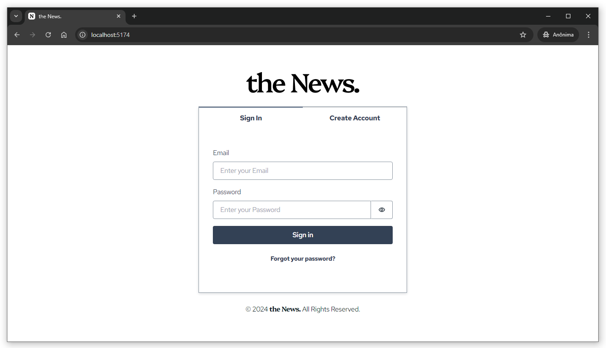

# the News. (Frontend assignment)

This is the repository of the frontend assigment from Mognito. You can access the live demo by clicking on the link below:

https://thenews.dalvanc.com

<div align="center">
  
</div>

## App requirements

#### 1. User can login to the app
- [x] Consider only email password login
- [x] User confirmation via OTP

#### 2. After login, the user can see a list of “News”
- [x] NEWS can have title
- [x] Tapping on any NEWS, users can see detailed screens where you will show a description
- [x] Users can press back to come to the NEWS page

## Installation

1. Clone the repository:

    ```bash
    git clone https://github.com/dalvancarvalho/mognito-frontend-assignment.git
    ```

2. Go to its folder:

   ```bash
   cd mognito-frontend-assignment
   ```

3. Install the project's dependencies:
   
   ```bash
   npm install
   ```
4. Run the development server:

   ```bash
   npm run dev
   ```

## Some considerations
